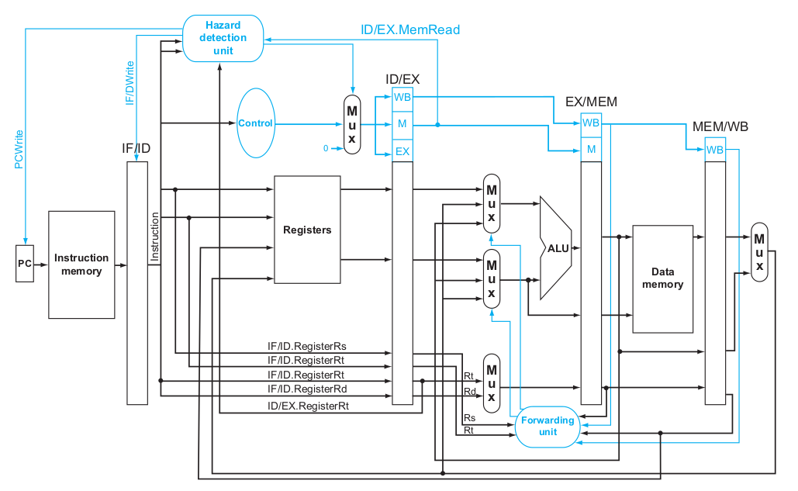

# RISC-V Project

To clone the project:
`git clone https://github.com/RISCeirb/Risc-v-processor.git`

## Introduction

This project explores the RISC-V instruction set, an open-source architecture designed to be simple, extensible, and modular. The processeur implemented is an adapted implementation of the paterson processeur for RISC-V  in VHDL.

## Overview of Different Processors with the RISC-V Base Instruction Set, version 2.2

This repository provides simple implementations of various RISC-V processors and tests using ModelSim and [Rars](https://github.com/TheThirdOne/rars) _RISC-V Assembler and Runtime Simulator_.

### LAST VERSION : [`RV32IM` (WITHOUT CSR AND FENCE INSTRUCTION) ](RV32IM)

Note : To improve the RV32IM, the process to calcul the MUL and DIV need to be divided in cycle to increase the max frequency of the processeur, a control unit can be added to improve the couple of instruction DIV/REM.
Just one calcul instead of two to improve the critical path.

### RV32I Base Instruction Set

The available processors have the RV32I Base Instruction Set: (WITHOUT CSR AND FENCE INSTRUCTION)
- Monocycle
- Pipeline
- Pipeline with Branch Predictor

Have made the processor following the RISC-V ISA and the Patterson Book describing a MIPS processor.

Here the difference:

|                   	| **RISC-V**                                            	| **MIPS**                                            	|
|-----------------------|-----------------------------------------------------------|---------------------------------------------------------|
| **Similarities**  	    | - Based on RISC architecture                          	| - Based on RISC architecture                          	|
|                   	| - Load/Store architecture                              	    | - Load/Store architecture                              	|
|                   	| - 32 general-purpose registers with a fixed zero register 	| - 32 general-purpose registers with a fixed zero register|
|                   	| - Fixed-size instructions (32 bits)                     	  | - Fixed-size instructions (32 bits)                    	|
|                   	| - Register to register operation                         	  | - Register to register operation                    	  |
| **Differences**    	| - Open-source, modular, and extensible ISA             	    | - Proprietary ISA with specific extensions             	|
|                     | - Rd always the destination register                     	  | - Rd or Rt (for load) can be the destination register  	|
|                   	| - Standardized extensions (RV32M, RV32F, etc.)          	  | - Specific extensions (MIPS-16, MIPS-3D, etc.)          |
|                   	| - Simplicity in design for various types of processors      | - Primarily designed for embedded systems              	|

### Monocycle Processor

A basic processor that executes one instruction per cycle. Momocycle processor MIPS in the Patterson Book that i have transform to RISC-V.

### Pipeline Processor

A 5-stage pipeline processor with the following stages:

- **IF (Instruction Fetch)**: The program counter provides the address of the new instruction.
- **ID (Instruction Decode)**: The instruction is sent to the control unit for decoding for the ALU.
- **EX (Execute)**: The ALU performs calculations for jumps and branches, and a unit calculates the new PC.
- **MEM (Memory Access)**: Load or store data from memory.
- **WB (Write Back)**: Write data into the destination register.

The pipeline is based on the Patterson book (not an exact representation since RISC-V ≠ MIPS).

- **Forwarding Unit**:  
  - This unit resolves data dependencies by forwarding results from later stages (such as MEM and WB) to earlier stages to avoid stalls.

- **Hazard Detection Units**:  
  - Two important units: one for load-use hazards and another for managing branch instructions. These units help prevent data conflicts and ensure correct pipeline execution.

### Pipeline with Branch Predictor

This processor uses a cache to predict whether a branch will be taken or not. (See the references for more explication).
The branch predictor unit is added in the ID stage to reduce the number of stall. I made the choice to include the jump in the branch predictor but we can also imagine moving the calculation of the pc in the ID stage for the JUMP in the future.

- **Direct-mapped memory**: 10-bit index, 20-bit tag, and two bits for branch prediction.

| PC       | TAG_PC | INDEX_PC | Useless bit (address in byte) |
|:---------|:------:|:--------:|:-----------------------------:|
| PC       | 31-12  |  11-2    | Useless bit (address in byte) |

**History table:**

| VALID | INDEX | TAG | Target PC | 2 bits Prediction |
|:------|:-----:|:---:|:---------:|:-----------------:|
| VALID | 0     | TAG | Target PC | 2 bits Prediction |
| VALID | 1     | TAG | Target PC | 2 bits Prediction |
| VALID | 2     | TAG | Target PC | 2 bits Prediction |
| ...   | ...   | ... | ...       | ...               |
| VALID | 511   | TAG | Target PC | 2 bits Prediction |

## FSM of the 2-bit Branch Prediction

## Overview of the RISC-V Instruction Set

RISC-V is a reduced instruction set computer (RISC) architecture that offers flexibility and efficiency for modern processors. Being open-source, it encourages collaboration and innovation without the constraints of proprietary licenses.

### Instruction Formats

The RISC-V instruction formats are:

1. **R-Type**: For arithmetic and logical operations.
2. **I-Type**: For operations with immediate values and loading data into registers.
3. **S-Type**: For store instructions.
4. **B-Type**: For branch instructions.
5. **U-Type**: For large immediate values.
6. **J-Type**: For jump instructions.

## Processor Testing

### Getting Started with Rars

To test our processors, we use ModelSim and Rars. An example source code is available on the Rars page, and i have implemented a bubble sort in RISC-V assembly to test the processors.

You can write your own assembly code with Rars and test it on the processors.

#### Steps to Generate Required Files

1. Write your assembly code in Rars.
2. **Run > Assembly**: Run the assembly code to view the instruction, data memory, and register file.
3. **File > Dump to File > .data**: Create the txt file for data memory. (You will probably have to change the writing format to make this file works)
4. **File > Dump to File > .text**: Create the txt file for instruction memory.

You can find an example of this two file in the file with the vhdl code.

### Getting Started with modelsim

You can look in the reference the tutoriel for the modelsim installation.

- Create a new project
- Add all the VHDL file of one of the processeur and also add the txt file to implement in the instruction and data memory.
- Compile all the file ( you will need to compile more than one time )
- Run simulation > Add wave >  ( you can set the time to 10 us and make the data in hexadecimal in the simulation property)
- Rerun and all the signal will be added

### Use of RISC-V cross complier to test c code 

You will need to install the [Risc-v cross complier](https://github.com/riscv-collab/riscv-gnu-toolchain), the final objective will be to test the processor with some signal processing application available on the code c section.

Here the instruction to compile the assembly code with the risc_v isa version rv32i. `-march=rv32i` enable to chose the extention of the compilier and `-mabi=ilp32` give access to rv32 because the compilier is set on rv64.
- `riscv64-unknown-linux-gnu-gcc -march=rv32i -mabi=ilp32 -S -o test_asm.s test_asm.c`
- Gray-filter for BMP picture

After the compilation of the code c in asm, the code is not ready for rars. So i have rewrite the data and the compileur will use the sp (stack pointer) to make the operation in the safe memory zone, call memcpy is not recognize by rars, so i have write my own version of memcpy. It's a fonction that choose a source address, a target address and copy a number of bytes. 

### Image processing application on risc-v processor [Gray-filter for BMP picture](Rars_code/grayfinal.asm)

We will use a Image processing application application on our processeur, the `RV32IM`, to test it. I use the code c to generate two files .txt that give the data of the image before and after processing.
To generate this file, just do gcc on your computer. `gcc -std=c99 -o recupdatarars recupdatarars.c` and `./recupdatarars >> imageorigine.txt` to get the data of the original picture.
`gcc -std=c99 -o test3 test3.c` and `./test3 >> imagefinal.txt` to get the data of the final picture.

[data image origine](code_c/imageorigine.txt)     [data image final](code_c/imagefinal.txt)

We verify data processing in the stack pointer (SP) of RARS. If the data matches, our code is functioning correctly, ensuring the correspondence between the text and hexadecimal addresses.

` Txt line = to_decimal(sp_address - hex_address)/3*4 ` (There is 3 pixel for each line and 4 byte per data)

Here, the data 0x4a at the address 0x7FEFBBC0 correspond to the data 74 in the line 12157 of the image_final.txt with the following calcul :

` Txt line = to_decimal(sp_address - hex_address)/3*4 = to_decimal(0x7FED81DC- 0x7FEFBBC0)/3*4 = to_decimal(239E4)/3*4 = 145892/3*4 = 12157 `
with the start address of the sp that is 0x7FED81DC in rars and in risc-v.

Here the image transformation :

     

## More about the memory zone in RISC-V

I have implemented only the data and instruction memory in this processor, to execute more advance program, you can add the heap and stack counter memory.

| **Memory**                   | **Start Address**      | **Description**                                                                                          |
|------------------------------|-----------------------|----------------------------------------------------------------------------------------------------------|
| **Instruction Memory**        | `0x00400000`          | Contains the program instructions to be executed.                                                        |
| **Data Memory**               | `0x10010000`          | Stores the program's static and global data.                                                              |
| **Heap Memory**               | `0x10040000`          | Space for dynamic memory allocation (heap).                                                               |
| **Stack Pointer (SP)**        | `0x7fffeffc`          | Stack pointer, used for local data and function calls.                                                    |
| **Global Pointer (gp)**       | Depends on the program| Pointer to global data, used for quick access to global variables.                                        |
| **MMIO (Memory-Mapped I/O)**  | Depends on implementation | Mapping of I/O devices into memory space, allowing interaction with hardware via memory.                  |

## “M” Standard Extension for Integer Multiplication and Division, Version 2.0

M-extension enable to do a multiplication and division between two register, the div_mul_unit can be add as a second alu. A new flag need to be added to stall the pipeline during the time that the calculation is running because it's take a long time.
- Reduce the critical path by sequencing this operation is the next step. Instead of using a long combinatory path, use a clock to sequence the process.

## “F” Standard Extension for Single-Precision Floating-Point, Version 2.0

The floating-point unit is not finished due to a lack of time. However, there is a section called FPU that i will add that is the begining of it. Also, Thirty-two registers need to be added to manipulate floating-point numbers. The CSR implementation needs to be added, or at least the floating-point control register.

## “A” Standard Extension for Atomic Instructions, Version 2.0

To be completed .. (futur VHDL File will be added)

## Future of the project

- Note that the CSR and FENCE instructiion are not implemented in this processeur even if present in the controle path.
- Possibility to add extention to the risc-v proccessor
- Use of different algorithme to test the processor (section code c in construction) (image processing)
- Addition of bootloader to implement the processor on fpga
- Changing solutions or increasing the stage number of the pipeline to increase the critical path.

## References

- [Documentation RISC-V](https://github.com/suryakantamangaraj/AwesomeRISC-VResources?tab=readme-ov-file#cores)
- [RISC-V Specification v2.2](https://riscv.org/wp-content/uploads/2017/05/riscv-spec-v2.2.pdf)
- [*Computer Organization and Design MIPS Edition: The Hardware/Software Interface* by David A. Patterson and John L. Hennessy ](https://theswissbay.ch/pdf/Books/Computer%20science/Computer%20Organization%20and%20Design-%20The%20HW_SW%20Inteface%205th%20edition%20-%20David%20A.%20Patterson%20%26%20John%20L.%20Hennessy.pdf)
- [Cache Documentation 1](https://cseweb.ucsd.edu/classes/su07/cse141/cache-handout.pdf)
- [Cache Documentation 2](https://courses.cs.duke.edu/spring09/cps104/lectures/2up-lecture17.pdf)
- [ModelSim Installation Tutorial](https://www.youtube.com/watch?v=Ubcm996KKhU)
- [Rars and Assembly in RISC-V](https://github.com/darnuria/esgi-riscv)
- [Risc-v cross complier](https://github.com/riscv-collab/riscv-gnu-toolchain)
- [BMP-Processing](https://stackoverflow.com/questions/54173733/convert-rgb-to-grayscale-in-bare-c)
- [M-extension explication](https://domipheus.com/blog/designing-a-risc-v-cpu-in-vhdl-part-21-multi-cycle-execute-for-multiply-and-divide/)
- [Division Algorithm](https://en.wikipedia.org/wiki/Division_algorithm)
- [Float_adder](https://www.ece.ucdavis.edu/~vojin/CLASSES/EPFL/Lectures/Guyot/francais/Flottan.htm)
- [Nan Float](https://www.doc.ic.ac.uk/~eedwards/compsys/float/nan.html)
- [Norme Float IEEE 754](https://fr.wikipedia.org/wiki/IEEE_754#Format_simple_pr%C3%A9cision_(32_bits))
- [Floating Point to Hex Converter](https://gregstoll.com/~gregstoll/floattohex/)
- [FPU-example](https://web.cecs.pdx.edu/~mperkows/CLASS_VHDL/VHDL_CLASS_2001/Floating/projreport.html)
- [FPU-Out of order example](https://www.researchgate.net/publication/281405300_Out_of_order_floating_point_coprocessor_for_RISC_V_ISA#pf4)
- [A-extension explication](https://www.digikey.fr/fr/blog/how-the-risc-v-atomic-extension-gives-you-superior-bit-manipulation-capabilities)
- Use of CHAT GPT for some parts of TEST BENCH and README writing

## Common Issues

- Ensure that the assembly code generated by Rars (.data and .text files) is placed in the same directory as the VHDL file of the processor you are using for simulation.
- Note that CentOS 7 is not compatible with Rars. (I didn't make it work, maybe you can)
